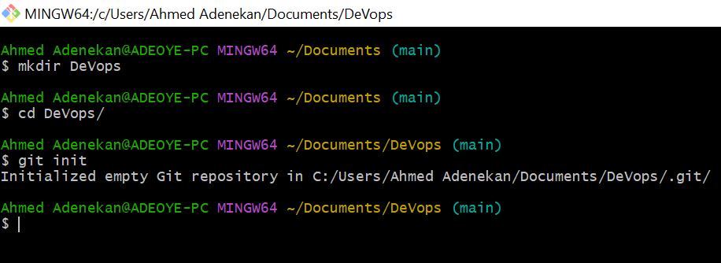
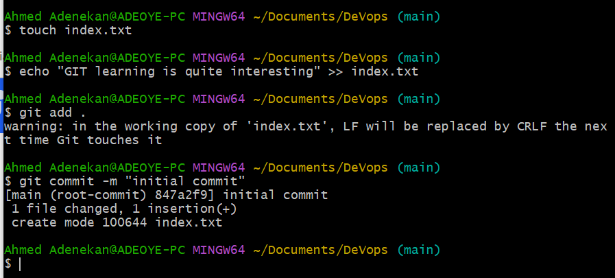

# GIT Project

What is git? Git is a distributed version control system, which essentially solves the problem of sharing source code efficiently and keeping track of changes made to the source code

# Initializing a repository and making commit

## - Initializing a Git repository

  - The steps below are followed;

  1.  Install Git
  2.  Open a Git bash terminal on the computer 
  3.  creare a directory call Devops using;   $mkdir DeVops
  4.  Change into this working directory using; $cd DeVops
  5.  run  $git init command

      

## Making the First Commit

  1.  Inside the working directory, create a file index.txt
  2.  Write a text inside the file say, "GIT learning i quite interesting"
  3.  Add the changes to GIT staging area using; $git add .
  4.  Commit the changes to GIT by running the command; $git commit -m "initial commit"

     

     