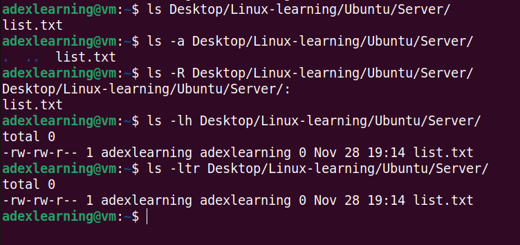
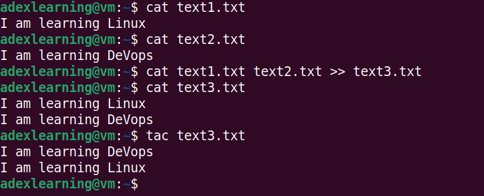
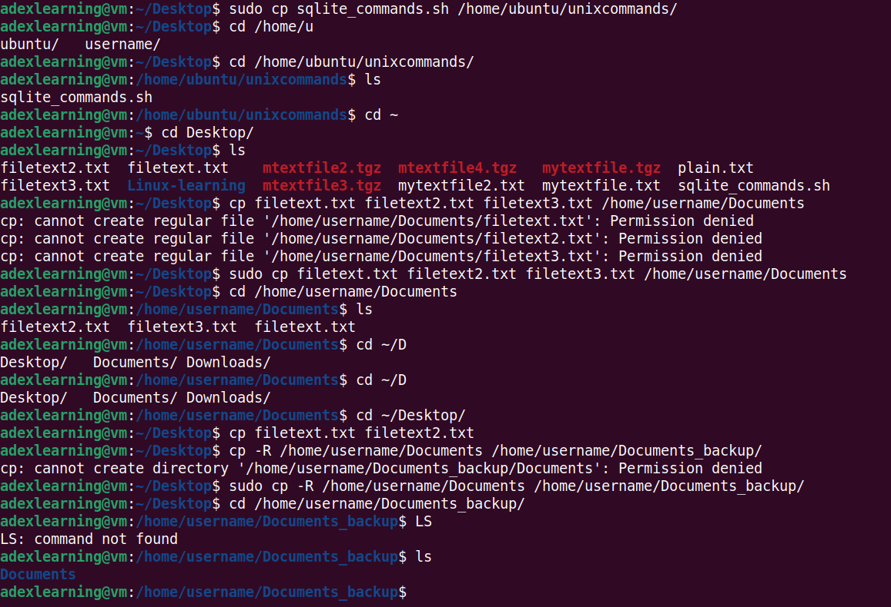
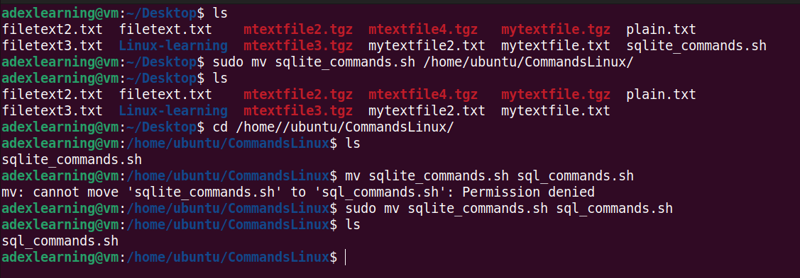
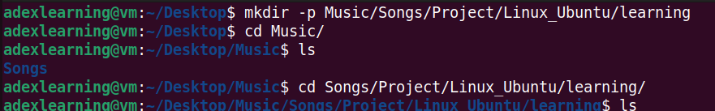
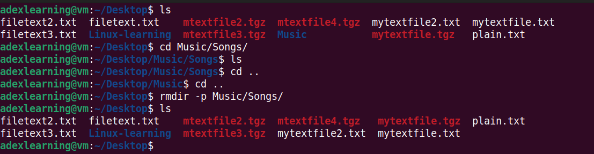
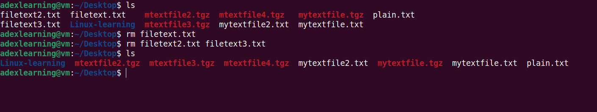
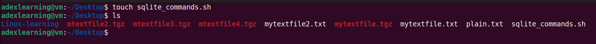

# Practicing Linux Commands

## File Manipulation

1. sudo command

    Upgrade of a Ubuntu Operating system build using Sudo command

    

2. pwd command

    pwd command is used to know the present working directory. It can be used with -L and -P option.

    

3. cd command

    It is used to navigate Linux files or directory. Depending on the current working direcctory, it requires either full part of the directory name.

    

4. ls command

    It is used to list files and directories within the system. It can be used with flags;
    -R : to list all the files in the subdirectories.
    lh : to list the size of the file in a more readable format such as MG, GB, TB etc

    

5. cat command

    Concatrnate or cat comand can be used to write the content of a file to the standard output
    It can be used to merge the content of two (2) i.e text1.txt and text2.txt files and stores the output in text3.txt

    

6. cp command

    cp copy files or directories and its content. It can also be used to copy the content of a file to another file in the same directory; cp filename1.txt filename2.txt. It can also be useed with flag -R to copy the entire directory.

    

7. mv command

    mv or move command can be used to move a file or directory from one location to the other. It can also be used to rename a file or a directory.

    

8. mkdir command

    It can be used to create one or multiples directory at the once and set a permision for each of them. -p option or flag create a directory between existing folders. 

    

9. rmdir command

    It is used to permanently delete an empty directory or a folder. -p flag can be used to delete an empty directory and the sub directories. 

    

10. rm command

     It is used to delete files and directories permanently. It can be used with flags -r, -f, -rf to delete directory and it content recursively.

     

11. touch command

     It allows you to create an empty file or generate and modify a time stamp in linux.

     

