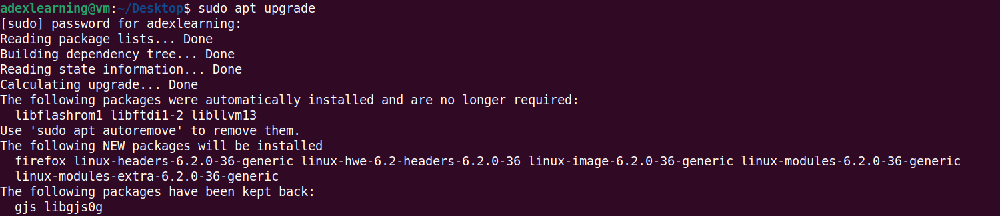
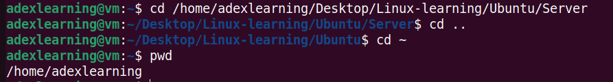

# Practicing Linux Commands

## **File Manipulation**

1. sudo command

    Upgrade of a Ubuntu Operating system build using Sudo command

    

2. pwd command

    pwd command is used to know the present working directory. It can be used with -L and -P option.

    

3. cd command

    It is used to navigate Linux files or directory. Depending on the current working direcctory, it requires either full part of the directory name.

    