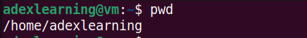

# Practicing Linux Commands

## File Manipulation

1. sudo command

    Upgrade of a Ubuntu Operating system build using Sudo command

    

2. pwd command

    pwd command is used to know the present working directory. It can be used with -L and -P option.

    

3. cd command

    It is used to navigate Linux files or directory. Depending on the current working direcctory, it requires either full part of the directory name.

    

4. ls command

    It is used to list files and directories within the system. It can be used with flags;
    -R : to list all the files in the subdirectories.
    lh : to list the size of the file in a more readable format such as MG, GB, TB etc

    

5. cat command

    Concatrnate or cat comand can be used to write the content of a file to the standard output
    It can be used to merge the content of two (2) i.e text1.txt and text2.txt files and stores the output in text3.txt

    

6. cp command

    cp copy files or directories and its content. It can also be used to copy the content of a file to another file in the same directory; cp filename1.txt filename2.txt. It can also be useed with flag -R to copy the entire directory.

    

7. mv command

    mv or move command can be used to move a file or directory from one location to the other. It can also be used to rename a file or a directory.

    

8. mkdir command

    It can be used to create one or multiples directory at the once and set a permision for each of them. -p option or flag create a directory between existing folders. 

    

9. rmdir command

    It is used to permanently delete an empty directory or a folder. -p flag can be used to delete an empty directory and the sub directories. 

    

10. rm command

     It is used to delete files and directories permanently. It can be used with flags -r, -f, -rf to delete directory and it content recursively.

     

11. touch command

     It allows you to create an empty file or generate and modify a time stamp in linux.

     

12. locate command

     It is used to find a file in the database system even if the exact name of the file is unknown. If the file name contains two or more word, hysterik can be used i.e locate ashade*lovinda. It can be used with -i flag to disregard the case sensitivity. i.e
     locate -i ashade*lovinda

    

13. find command

     It is used to search for file(s) within a specific directory and perform a subsequent operations.

     

14. grep command

     Global regular expression print (grep) let you find a word by searching through all the text in a specific file.
     once it finds a match, it prints all lines that contain the specific pattern.

     

15. df command

     df is used to report the system disk space usage. It can be used with flags such as -TH to give the output in a more human redable format i.e KB, MB, GB etc

     

16. du command

     It is used to check how much space a file or a directory takes up. It can be used with -sh option to provide a folder or a file information in KB, MG etc

     

17. head command

     The head command allows you to view the first 10 lines of a text. It can be used with -n flag to specify the number of lines to be displayed i.e head -n 5 cyber.txt.

     

18. tail command

     The tail command allows you to view the last 10 lines of a text. It can be used with -n flag to specify the number of lines to be displayed i.e tail -n 5 cyber.txt.

     

19. diff command

     The difference command (diff) compares two contents of a file line by line. After analysing them, it displays the part that do not match. It can be used with -c option to display the difference between two files in a context form.

     

20. tar command

     It archives multiple files or directories into a TAR file. It can be used with -cvf option to compress files or directories or -xvf option to decompress files of directories.

     

## File Permissions and Ownership

21. chmod command

     chmod is a command that modifies the read, write and execute permission of a file or directory. For example chmod 777 commands.tar changes the user, group and others permissions to rwx.

     

22. chown command

     The command allows you to change the ownership of a file, directory or a symbolic link to a specified username.

     

23. jobs command

     This is a process that the shell starts. Jobs allows you display all the running processes along with their statuses. It can be used with option;
     -l : to list process IDs along with their information
     -p : to list the process IDs only

     

24. kill command

     It is used to close or terminates unresponsive program or application manually. The process identification number (PIDs) of an application must be known before such an application can be killed. i.e ps -ux will display all processes along with their IDs.

     

25. ping command

     This is a great troubleshooting command which can be used to check whether an endpoint or a host is reachable or not.

     

26. wget command

     This command allows you download files over the internet. The command retrieves files using HTTP, HTTPS, FTP protocols.

     

27. uname command

     This print detailed information about your linux operatind system and hardware.

     

28. top command

     This displays all the running processes and the dynamic real time view of the current system.

     

29. history command

     The system uses history command to list up to 500 previously executec commands allowing you to reuse them without having to re-enter it. It can be used with -c option to completely clear the history list.

     

30. man command

     This provides a user manual of any command or utility you can run on the terminal including the name and various options which can be used along with the command

     

31. echo commmand

     This is the built-in utility that displays a line of text or string using a standard output. It can be used with option -n : to display the output without trailing new line, /b : remove spaces in between text, /c : produces no further output.
     
     

32. zip and unzip command
    
     It compresses the file into a ZIP file. It can automatically choose the best compression ratio. It can be used to archives files or directories and reducing thr disk storage. Unzip command extracts the all files from the specified ZIP archive.
     
     

33. hostname command

     This is used to know the system hostname. -A or -all display the machine's fully qualified domain name. -ip option display the system's ip address.

     
     

34. useradd, userdel command

     useradd or adduser is used to create a new linux user account. only those with root or sudo are permitted to run this command. i.e useradd name or adduser name
     userdel is used to remove or delete an existing user account.
     
     

35. apt-get command

     This is a command line used for handling the Advanced Package Tool libraries in linux. It helps to retreive information and bundles from authenticated souces to manage, update, remove and install softwares and its dependencies.

     

36. nano, vi, jed command

     These are tools used to manage and edit user files via a text editor. nano and vi came with the operating system while jed has to be installed.
      vi filename
      nano filename
      jed filename
     
     

37. alias, unalias command

     alias allows a user to create a shortcut with the same functionality as a command, filename or text.
     i.e alias name="string"
         alias k="kill" or
         alias st="systemctl"

     on the other hand, unalias deletes the existing alias. i.e unalias k

     

38. su command

     su or switch user command allows a user to run a program as a different user. It changes the administrative account from the current login session. i.e su option username
     Note: when su command is used without any username, it assumes you are accessing the root account temporaritly and once the password is supplied, access is granted.

     

39. htop command

     htop command monitors system resources and server processes in real time. It can be used with -d option to show the delay beetween updates in tenth of seconds i.e htops options

     

40. ps command

     ps or process status produces the snapshot of all currently running process on your system. It can be used with -T option to display all processes associated with the current shell session. 

     

    

     

